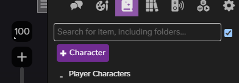

# Roll20 Journal Search

This browser extension adds a search bar to the Roll20 journal, allowing you to quickly find characters, handouts, and notes by filtering entries in real-time and hiding empty folders. It works automatically when you load Roll20.

  
  

  
  

## How It Works

You can type in the search box to filter entries in real-time. The mode switch allows you to toggle between two search modes:

- **Entry Search**: Filters individual journal entries (characters, handouts, notes) based on the search term. Only entries that match the search term will be displayed, and folders containing no matching entries will be hidden.
- **Search by Item, Including Folders**: Filters both individual entries and folders based on the search term. Folders that match the search term will be displayed along with their contents, and all parent folders will be shown to maintain the folder hierarchy. This is the default mode and should fit most use cases unless there are certain folders named like items.

## Installation
1. Download the ZIP file from the [latest release](https://github.com/Wholffe/Roll20JournalSearch/releases).
2. Extract the ZIP file.

### Google Chrome
3. Open `chrome://extensions/`
4. Enable **Developer mode**
5. Click **"Load unpacked"**
6. Select the folder with the extension files

### Mozilla Firefox
3. Open `about:debugging#/runtime/this-firefox`
4. Click **"Load Temporary Add-on"**
5. Select the `manifest.json` file

## Contribution

Contributions to this repository are welcome! If you have additional ideas or improvements, feel free to submit pull requests.

## License

This repository is licensed under the [MIT License](./LICENSE).